# PLL-Design-using-Sky-130
Phase Locked Loop(PLL) IC Design using Open-Source PDK's by Google-Skywater | VSD-IAT Workshop

## Introduction to PLL(Phase Locked Loop)

### What is PLL?
In simple terms,A phase-locked loop is a closed-loop feedback control circuit that's both frequency and phase sensitive.It is an electronic circuit with a voltage-driven oscillator that constantly adjusts to match the frequency of an input signal.It can also be used to generate a signal with a frequency that is multiplied by a fixed factor compared to the frequency of a reference signal.

### Why PLL?

**End Goal: To get precise clock signal without frequency or phase noise**
>Clock Signal can be generated using Voltage Controlled Oscillator(VCO) or Quartz Crystal

| Quartz Crystal|      VCO      |
| ------------- | ------------- |
| Can give signal with pure spectrum(single frequency)  | Presence of phase noise  |
| Not flexible | Flexible(can generate signals with flexible frequencies )  |

*The purpose of PLL is to make VCO mimic(same or multiple of ref freq) spectral purity of Quartz at the same time maintaing flexibility.*
 

## Block Diagram of PLL

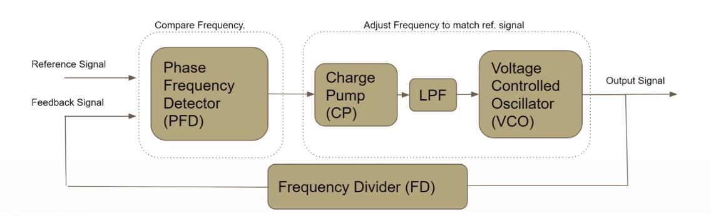

## Components in detail

### 1. Phase Frequency Detector(PFD)

PFD Circuit is used to compare the input reference and output feedback signals to generate Up and Down signals depending on whether feedback signal leads or lags compared to reference signal.
***
#### **State Diagram**
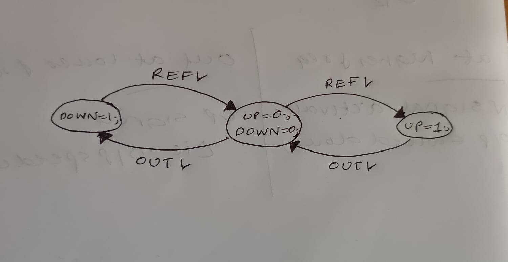
***
#### **Circuit**
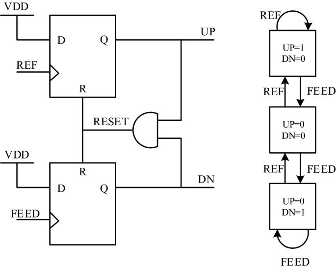
***
#### **Drawback**
When the phase difference between reference signal and feedback signal is very very small, the PFD circuit does not detect as Up/Down signals are not given enough time to toggle completely. This condition is called Dead Zone.Hence more precise circuit should be designed.

### 2. Charge Pump
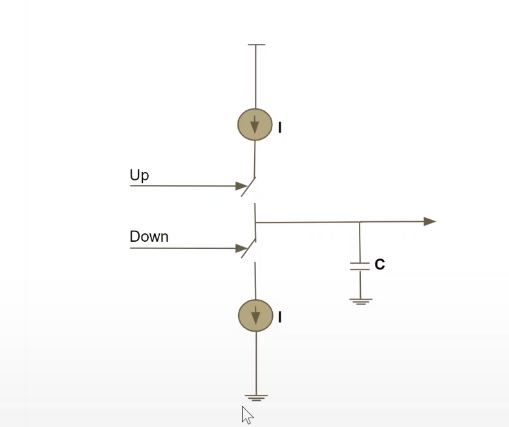

Charge Pump converts the digital input to a analog signal which is used by Voltage Controlled Oscillator(VCO) circuit. Charge Pump can ge designed using current steering circuit.
***
#### Working
If  Up signal == 1, the current flows from Vdd to output capacitor thus charging it. 
If Down signal == 1, the current flows from output capacitor to Ground and thus discharging the Capacitor. 
The output of the charge pump depends on the average time of Up being 1 and Down being 1. If the average time with Up being 1 is more, output voltage increases and the voltage across capacitor decreases in other case. 
***
But there can be leakage current even if both Up and Down are 0.This leakage current can impact the output signal and inturn the performance of VCO. Moreover, there can be frequency fluctuations at the output of the Charge Pump and this can be taken care with the help of a **Low Pass Filter (LPF)** at the output.

**Charge Pump Circuit with LPF at the output** 
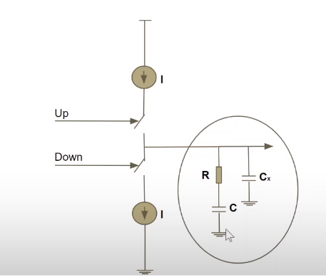
 
LPF helps in limiting high frequency fluctuations and  maintains the stability of the entire PLL control system as we are adding a Pole to the system.

**Thumb rules for component values**

1. Output Capacitance = Capacitance of LPF/10
2. Loop Filter Bandwidth ~= (Highest output Frequency)/10 Loop filter Bandwidth is 1/(1+RC1) where C1 = (C*Cx)/C+Cx

### 3. Voltage Controller Oscillator(VCO)
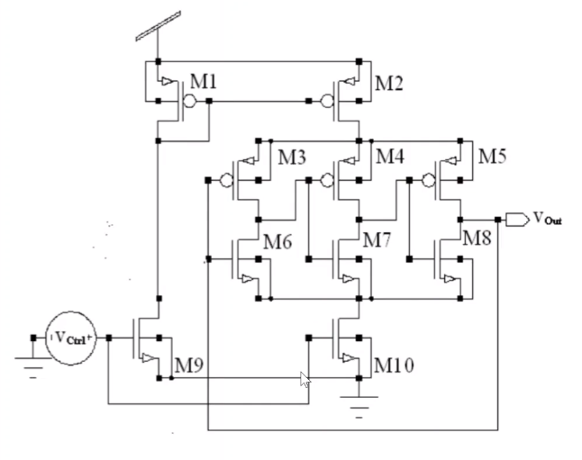 

VCO circuit is used to generate a signal with a frequency that varies depending on the voltage of the input signal(from Charge dump). It is implemented using a Ring Oscillator that has odd number of inverters with a specific delay connected in a series. This makes the output signal to toggle after a certain amount of delay.

 
- Time Period of the signal generated = 2*(Delay of each inverter)*(number of inverters)
 
- Frequency depends on the time period which inturn depends on the delay and which inturn depends on the current supplied.  
- If a large current is supplied at the output, the output gets charged faster. 
- Current starving mechanism can be used to obtain flexibility(variable frequences).  
- It should be kept in mind while designing circut that the frequencies that VCO generates must be in the same range of frequencies that the PLL supports.

### 4.  Frequency Divider
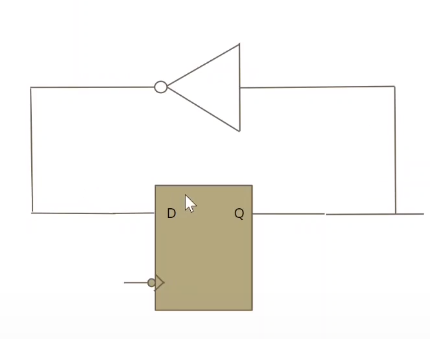
**Freq divider by 2**
 
A frequency divider circuit generates an output signal with a frequency reduced by a certain factor with repsect  to the input signal. 

Multiple Frequency divider by 2 circuit can be cascaded to get frequency divided by a certain factor (multiple of 2) circuit. 
Eg. Divider by 8 can be obtainbed using 4 div by 2 circuits

## Common Terms wrt PLL

- Lock range: It is the range of frequencies for which PLL will maintain its locked state given that it is already in locked state.

- Capture Range: It is the range of frequencies for which PLL comes to locked state from unlocked state(<Lock range)

- Settling Time: It is the time taken by the PLL to attain a lock from the initial unlocked state.

## Design Flow & Tools
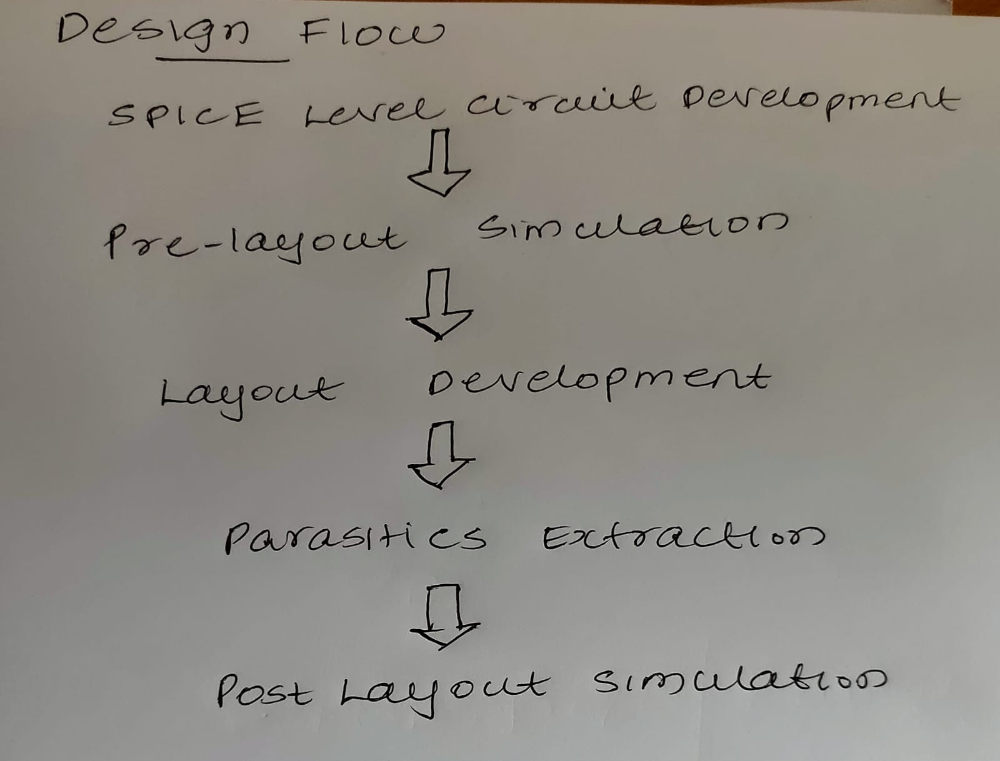 

Tools Used : Magic& ngspice

## Skywater 130nm PDK Overview
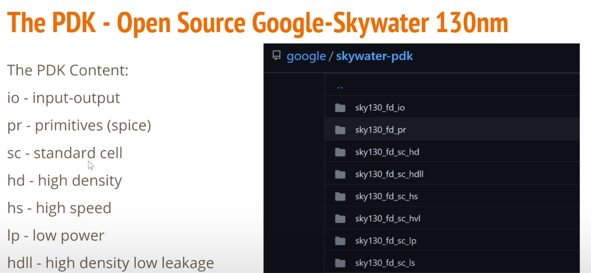 

## PLL Circuit Specs

8x multiplier PLL specifications for this workshop

- TT - Corner (Typical Typical)
- VDD (Digital Supply) - 1.8V
- Temperature - Room Temeperature (27C)
- Both VCO and PLL Modes
- Reference Clock Frequency - 5MHz to 12.5MHz
- Output Clock Frequency - 40MHz to 100MHz
- Jitter (RMS) <~20ns
- Duty Cycle -50%
 
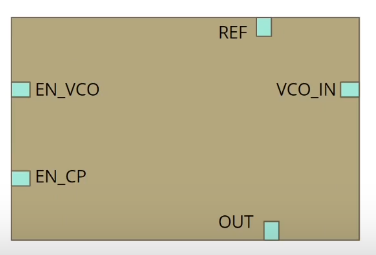 

## Individual Circuits for Pre-Layout
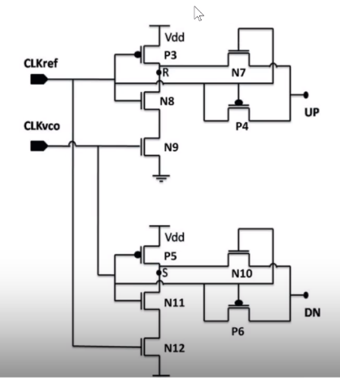 PFD

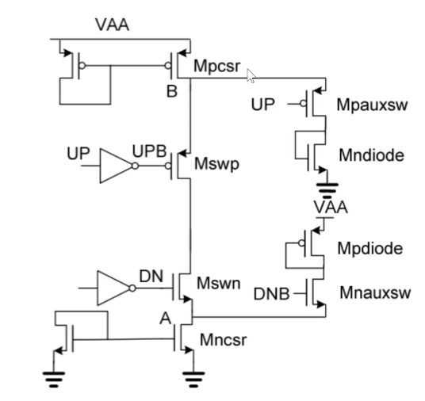 CP

 VCO

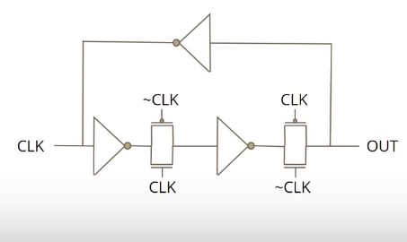 FD

